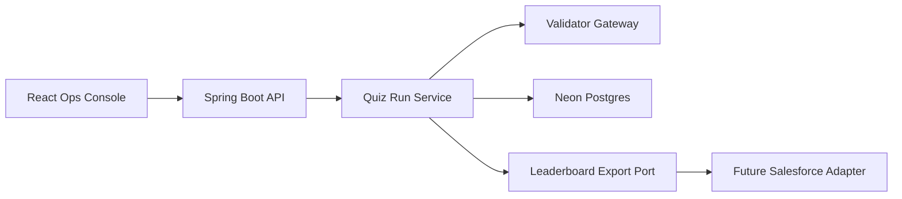

# Quiz Leaderboard System

Spring Boot backend and React/Tailwind ops console for the Bajaj Finserv Health quiz leaderboard assignment.

## Stack

- Backend: Java 21+, Spring Boot 4.0.6, Spring Data JPA, Actuator, Flyway, PostgreSQL
- Frontend: React 19, Vite 8, Tailwind CSS 4, React Router 7, TanStack Query 5
- Database: Neon Postgres

## What It Does

- Polls the validator API exactly 10 times for `poll=0..9`
- Preserves raw poll payloads for auditability
- Deduplicates events by `roundId + participant`
- Aggregates participant totals and generates the leaderboard
- Submits the computed leaderboard exactly once
- Exposes run history and run detail APIs for the frontend console
- Keeps a future-ready export port for Salesforce integration

## Repo Layout

```text
.
├── backend
└── frontend
```

## Architecture



## Environment

Copy [`.env.example`](/Users/jaskrrishsingh/jas/bajaj-java-salesforce/.env.example) to `.env` and provide your Neon connection details.

The backend now imports `.env` automatically from either:

- the repo root when you run from the repo
- the parent directory when you run from `backend/`

Important:

- `DB_URL` must be a JDBC URL
- `DATABASE_URL` can remain in plain Postgres URI form for reference

## Run The Backend

```bash
cd /Users/jaskrrishsingh/jas/bajaj-java-salesforce/backend
mvn spring-boot:run
```

Default backend URL: [http://localhost:8080](http://localhost:8080)

Useful endpoints:

- `POST /api/runs`
- `GET /api/runs`
- `GET /api/runs/{runId}`
- `GET /api/runs/{runId}/polls`
- `GET /api/runs/{runId}/leaderboard`
- `GET /api/runs/{runId}/submission`

## Run The Frontend

```bash
cd /Users/jaskrrishsingh/jas/bajaj-java-salesforce/frontend
npm install
npm run dev
```

Default frontend URL: [http://localhost:5173](http://localhost:5173)

## Tests

Backend:

```bash
cd /Users/jaskrrishsingh/jas/bajaj-java-salesforce/backend
mvn test
```

Frontend unit tests:

```bash
cd /Users/jaskrrishsingh/jas/bajaj-java-salesforce/frontend
npm test
```

Frontend e2e:

```bash
cd /Users/jaskrrishsingh/jas/bajaj-java-salesforce/frontend
npx playwright install chromium
npm run test:e2e
```

## Notes

- The default runtime JPA mode is `update` so a fresh Neon database can boot without manual pre-provisioning.
- The Flyway migration is still included in [`backend/src/main/resources/db/migration/V1__create_tables.sql`](/Users/jaskrrishsingh/jas/bajaj-java-salesforce/backend/src/main/resources/db/migration/V1__create_tables.sql).
- The Salesforce export path is intentionally a no-op adapter in v1.
